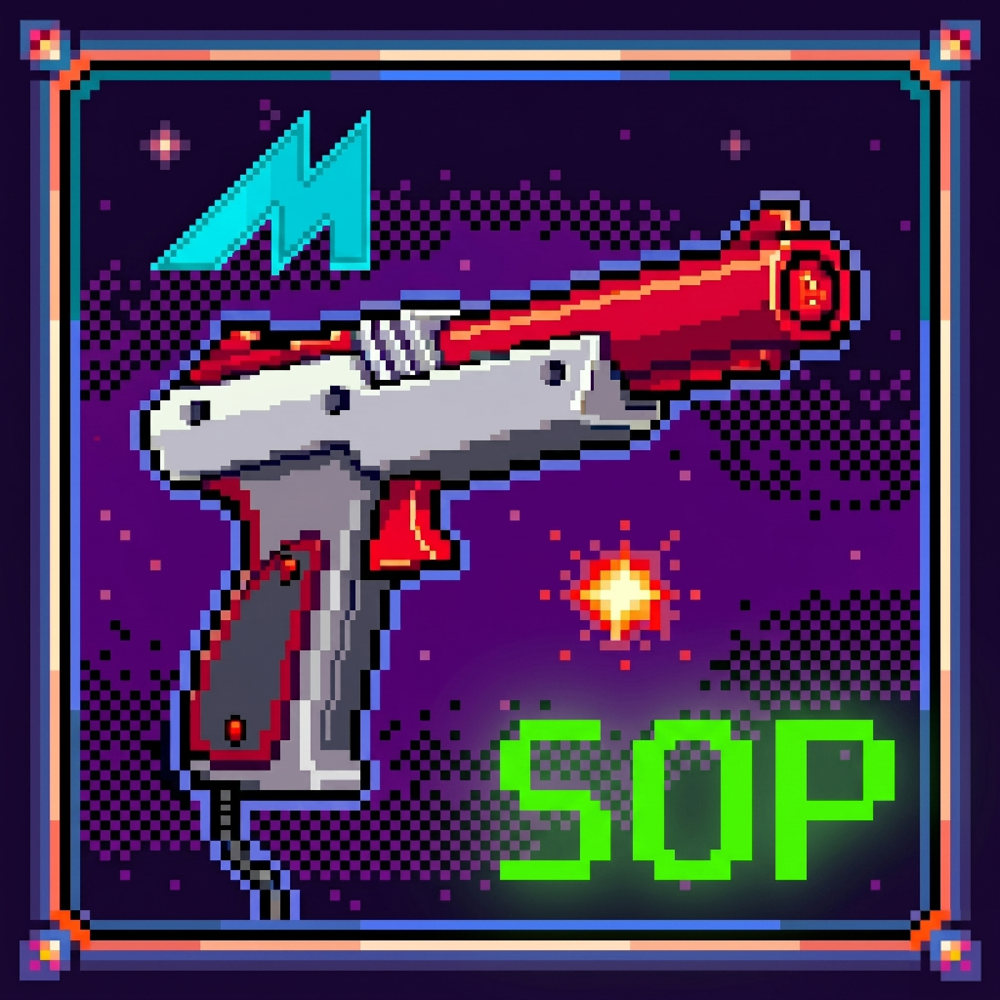

# MAME State Output Project (Plugin and Configurator)

  

**A universal state output plugin framework for MAME designed to enable force feedback (recoil, reload, rumble, lights, display, etc.) for games that lack native state outputs or require additional state output triggers. Currently aimed at light gun games, but other genres can be easily supported as well by the community.**

---

## 📖 Historical Context: From Lua Script to MAME Plugin

Previously, this project was known as the "Universal MAME Lua Script for State Outputs". It relied on standalone Lua scripts for each game / ROM to monitor memory addresses and output states. While effective, as the list of supported games grew, we needed a more robust and integrated solution.

We have since migrated to a **native MAME Plugin architecture** to establish a centralized state output framework. This transition allows us to:
* Optimize background performance and reduce overhead.
* Seamlessly integrate with MAME's built-in plugin ecosystem.
* Automate the generation of configuration files.
* Easily add support for new games / ROMs by updating a single file (database.lua).
* Provide a more stable foundation for future community contributions.

---

## ⚙️ What Does This Do?

Many classic MAME arcade games do not natively output "state" data. Without this data, external tools like [**Hook of The Reaper (HOTR)**](https://hotr.6bolt.com/), [**MAME Hooker**](https://dragonking.arcadecontrols.com/static.php?page=aboutmamehooker), [**OutputHooker**](https://github.com/PolybiusExtreme/OutputHooker), and/or [**QMameHook**](https://github.com/SeongGino/QMamehook) have no way of knowing when you fire your weapon or take damage. This means your light gun's physical recoil, rumble, lights, display, etc. won't work.

This plugin fixes that. It quietly monitors the game in the background and sends a standardised signal to your hardware whenever an action state event happens, ensuring your hardware physically aligns to what is happening in-game and on-screen.

---

## 🛠️ Installation & Setup

> [!IMPORTANT]  
> **Backup your files.** This installation replaces existing scripts/plugins to prevent conflicts. It is recommended that you backup your configured 'Hooker' Program folder prior to installation.

### Option 1: Automatic Installation (Recommended)
We provide a custom Configurator app to streamline the installation and ensure all files are placed in the correct directories automatically. This will automatically update both MAME and your relevant Output Program(s). We highly recommend this app be used to install and configure your build.

1. Download the latest version of the **Configurator App**, extract the executable, and run it.
2. Follow the on-screen prompts. The tool will automatically clean out old conflicting scripts and copy the latest plugin framework files directly into your MAME and relevant Output Program(s) directories.

### Option 2: Manual Installation & Migration
If you prefer to manage the file structure yourself, please follow these manual steps:

#### Step 1: Clean Up Old Architecture (Crucial for Upgrading)
To prevent conflicts between the old standalone scripts and the new plugin, you must remove the old files first:
1. **Remove Old Scripts:** Navigate to your `MAME\scripts` directory and delete any `.lua` files or folders associated with the previous State Output project (v7 and below).
2. **Remove Old INIs:** Navigate to your `MAME\ini` folder and delete any `.ini` configuration files or folders associated with the previous State Output project (v7 and below).

#### Step 2: Install the New Plugin
1. **MAME INI:** Copy the new `.ini` files from the latest release to your `MAME\ini` folder. *(Use the version that matches your "off-screen reload plugin" preference).*
2. **MAME Plugins:** Copy the extracted plugin folders from the latest release into your `MAME\plugins` directory. 
3. **Enable Output:** Open your `mame.ini` file in the MAME root directory and ensure the output is set to network:
`output network`
4. **Enable Plugin:** Ensure the plugin is enabled in your `plugin.ini` file.

#### Step 3: Output Programs ('Hooker' Programs)
There are many state output 'hooker' programs that exist, however, support has been provided for the following tools:

**Hook of the Reaper (HOTR) (Recommended)**
[**GitHub**](https://github.com/6Bolt/Hook-Of-The-Reaper) | [**Website**](https://hotr.6bolt.com/)
1. **Clean Old Scripts:** Navigate to `HookOfTheReaper\defaultLG\` and **delete** the folder named `MAME_LUA`.
2. **Copy New Files:** Copy the files from the `defaultLG` folder from the latest release into your `HookOfTheReaper\defaultLG\` directory. Overwrite any files when prompted.

*(Note: Refer to documentation for MAME Hooker, OutputHooker, and QMameHook setup, which will be expanded later once the Configurator App can handle automatic ini generation).*

---

## 🔫 Light Gun Compatibility

This plugin handles the logic, while your external Output Program handles the communication to your light gun or physical hardware. Verified supported hardware includes:

* Alien
* Blamcon
* Gun4IR
* Retroshooter MX24
* Retroshooter RS3 (Reaper Pro)
* Sinden
* X-Gunner

---

## 🕹️ Supported MAME ROMs / Games

The latest source code and release includes support for the following MAME ROMs / games:

| ROM | Game |
| :--- | :--- |
| `alien3` | Alien3: The Gun |
| `area51` | Area 51 |
| `area51mx` | Area 51 / Maximum Force Duo |
| `bbust2` | Beast Busters: Second Nightmare |
| `bel` | Behind Enemy Lines |
| `carnevil` | CarnEvil |
| `cryptklr` | Crypt Killer |
| `dragngun` | Dragon Gun |
| `duckhunt` | Vs. Duck Hunt |
| `hotd` | The House of the Dead |
| `invasnab` | Invasion: The Abductors |
| `jdredd` | Judge Dredd |
| `jpark` | Jurassic Park |
| `le2` | Lethal Enforcers II: Gun Fighters |
| `lethalen` | Lethal Enforcers |
| `lethalj` | Lethal Justice |
| `maxforce` | Maximum Force |
| `policetr` | Police Trainer |
| `ptblank` | Point Blank |
| `sgunner` | Steel Gunner |
| `sgunner2` | Steel Gunner 2 |
| `timecris` | Time Crisis |
| `timecrs2` | Time Crisis II |
| `vcop` | Virtua Cop |
| `vcop2` | Virtua Cop 2 |

If you encounter a new issue that isn't documented, please create a new issue on GitHub [here](https://github.com/djGLiTCH/MAME-LUA-SCRIPT-STATE-OUTPUTS/issues).

---

## 🔧 Under the Hood (Technical Details)

This section is for developers or community members looking to adapt the plugin for new games or troubleshoot logic.

### The Translation Layer
In-game actions trigger changes in memory addresses, but these vary wildly between games. For example, one game might count ammo down (10 to 0), while another counts total shots fired infinitely upward.

The plugin monitors four key memory addresses (Credits, Game Status, Ammo, Life) and combines this with a complex set of logic to determine several game-specific values or triggers while utitlising a standardised output.

### Standardised Variables & Priority Logic
To ensure reliable performance across all titles and prevent "phantom" hardware triggers, the plugin relies on a unified variable naming convention and strict evaluation logic:

1. **Player State Priority:** The plugin evaluates activity using a strict hierarchy: player-specific STATUS > player-specific LIFE > global GAME_STATUS > fallback logic.
2. **Active Player Tracking:** It utilizes a dedicated gamestatus variable to accurately track active players, which prevents unwanted force feedback during attract mode when nobody is playing a game.

By funneling all game events through this standardised logic flow, external tools only have to listen for simple, consistent commands (e.g., PX_Life = 1), taking the pressure off the Output Program(s) to decipher complex game states.

---

## 🤝 Contributing & Credits

This is a community-driven project. If you find a game that isn't supported, please build this out in the latest `database.lua` file to map the memory addresses and submit a Pull Request!

**Special Thanks:**
* Muggins, for all of his help and support. Without his tireless efforts in testing each release and suggesting quality of live improvements, it would not be what it is today.
* Bandicoot, for all of his helpin testing newly supported games for this project.
* Hexxed, for all of his help in testing new design ideas, suggestions for improvements, and general architecture discussions for this project.
* Argon, for the initial Lua script concept that sparked the idea for this project.
