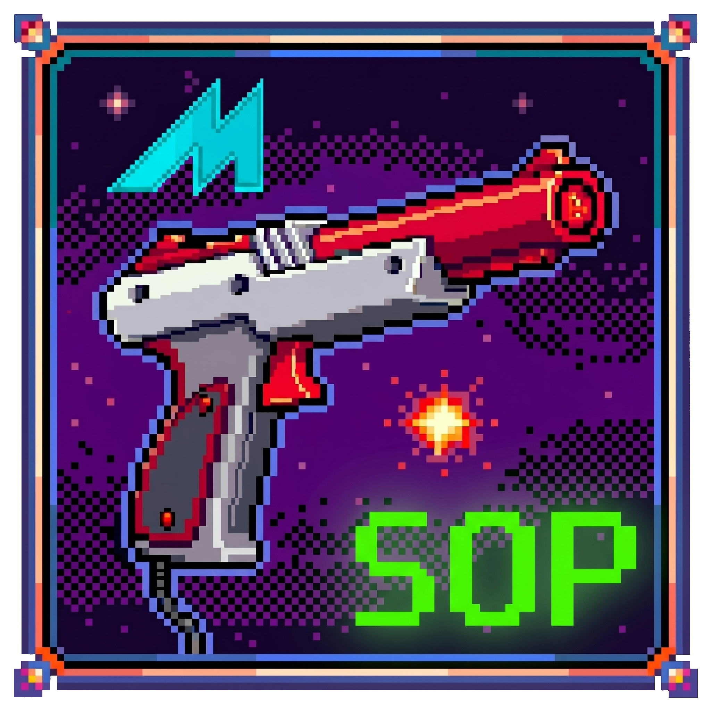

# MAME State Output Project (MSOP)

[](https://www.gnu.org/licenses/gpl-3.0)
[](https://mamedev.org/)

<p align="center">
  
</p>

**A universal state output plugin framework for MAME designed to enable force feedback (recoil, reload, rumble, lights, display, etc.) for games that lack native state outputs or require additional state output triggers. Currently aimed at light gun games, but other genres can be easily supported as well by the community.**

---

## 📅 MAME Compatibility & Release Status

> **In short:** the current release, **MSOP Plugin v8**, supports **MAME 0.200 to 0.288**. Support for **MAME 0.289 and later** arrives with **MSOP Plugin v9 combined with MESH v1**, both targeted for release around **mid-August 2026**.

MAME 0.289 removed the ability for a Lua plugin to create state outputs. MAME can therefore no longer hold - and no longer broadcast - any of MSOP's custom outputs on 0.289 and above, in any `-output` mode. This was a deliberate change by the MAME development team, and it is not something a plugin can work around on its own. From v9, MSOP delivers its outputs over its own relay instead, which the MESH app hosts - and that is why the two are released together.

| | MAME 0.200 - 0.288 | MAME 0.289 and later |
| :--- | :--- | :--- |
| **MSOP Plugin v8** (current release) | ✅ Supported | ❌ Not supported |
| **MSOP Plugin v9 + MESH v1** (upcoming) | ✅ Supported | ✅ Supported |

### Where things stand today

* **On MAME 0.288 or earlier:** everything in this repository works right now. Install MSOP Plugin v8 with the MSOP Configurator (or by hand) and carry on as normal.
* **On MAME 0.289 or later:** please stay on MAME 0.288 for the moment, or wait for the v9 + MESH v1 release. No currently released version of MSOP can deliver state outputs on 0.289+.

### What is coming (targeting mid-August 2026)

* **MSOP Plugin v9** - *currently unreleased.* Delivers state outputs over the MSOP relay, so a single install covers **MAME 0.200 and above, including 0.289+**, with no custom or patched MAME build required.
* **MESH (Modern Emulator State Hub) v1** - *currently unreleased, and in private beta testing.* The successor to the MSOP Configurator. It hosts the relay that Plugin v9 delivers through, and it can also drive peripherals (e.g. light guns) and cabinet lighting natively with no external hooker program at all. **MESH is required for MSOP Plugin v9 on MAME 0.289+.** Its own GitHub repository will be published with the public release.
* **MSOP Configurator v1.1.0** - the **final** MSOP Configurator update, published once Plugin v9 and MESH v1 are both released. Its purpose is migration: existing installs will update to it automatically, and it will assist you in moving across to MESH. The MSOP Configurator is retired after this release, and all further app development continues in MESH, with MSOP being purely reserved for the MSOP Plugin which creates custom state outputs in MAME.

MSOP Plugin v9 and MESH v1 have been in the making for the past few months, and have been developed and privately beta tested together as a pair over that whole period - the plugin's state outputs are delivered through the app's relay, so neither side can be properly tested without the other. That testing is why both are released together rather than separately.

This repository remains the home of the MSOP Plugin, the game database, and the generated 'Hooker' files for each supported game, before and after that transition.

---

## 📖 Historical Context: From Lua Script to MAME Plugin

Previously, this project was known as the "Universal MAME Lua Script for State Outputs". It relied on standalone Lua scripts for each game / ROM to monitor memory addresses and output states. While effective, as the list of supported games grew, we needed a more robust and integrated solution.

We have since migrated to a **native MAME Plugin architecture** to establish a centralized state output framework. This transition allows us to:
* Optimize background performance and reduce overhead.
* Seamlessly integrate with MAME's built-in plugin ecosystem.
* Automate the generation of configuration files.
* Easily add support for new games / ROMs by updating a single file (database.lua).
* Provide a more stable foundation for future community contributions.

Looking to the future, the need to configure, maintain, and update MSOP became increasingly obvious. This was initially addressed by the MSOP Configurator app, which worked quite well, but as that app grew in scope and complexity it was time to branch this off into another project.

That successor is **MESH (Modern Emulator State Hub)**, which has been in the making for the past few months alongside MSOP Plugin v9 and is currently in private beta testing, so it is not yet publicly available. Once released it becomes the recommended way to install and use MSOP, and its own GitHub repository will be published at the same time.

Until then, the **MSOP Configurator** remains the supported installer for MSOP Plugin v8 on MAME 0.200 to 0.288. When MESH is released, existing MSOP Configurator installs will receive a final v1.1.0 update that prompts and assists with the migration to MESH - see [MAME Compatibility & Release Status](#-mame-compatibility--release-status) above. The MSOP GitHub remains the repository for storing the MSOP Plugin, Database, and relevant 'Hooker' files for each supported game.

---

## ⚙️ What Does This Do?

Many classic MAME arcade games do not natively output "state" data. Without this data, external tools like [**Hook of The Reaper (HOTR)**](https://hotr.6bolt.com/), [**MAMEhooker**](https://dragonking.arcadecontrols.com/static.php?page=aboutmamehooker), [**OutputHooker**](https://github.com/PolybiusExtreme/OutputHooker), and/or [**QMamehook**](https://github.com/SeongGino/QMamehook) have no way of knowing when you fire your weapon or take damage. This means your light gun's physical recoil, rumble, lights, display, etc. won't work.

This plugin fixes that. It quietly monitors the game in the background and sends a standardised signal to your hardware whenever an action state event happens, ensuring your hardware physically aligns to what is happening in-game and on-screen.

---

## 🔫 Light Gun Compatibility

This plugin handles the logic, while your external Output Program handles the communication to your light gun or physical hardware. Verified supported hardware includes:

* Alien
* Blamcon
* Gun4IR
* OpenFIRE
* Retroshooter MX24
* Retroshooter RS3 (Reaper Pro)
* Sinden
* X-Gunner

Automatic configuration for your light guns can be made today using the **MSOP Configurator**, and once it is publicly released, with **MESH (Modern Emulator State Hub)** - my new project that builds upon what was created in MSOP.

---

## 🕹️ Supported MAME ROMs / Games

While there are no guarantees that support will be added for every MAME ROM / game (as this takes a lot of my personal time without community contributions and technical hurdles may prevent some games from being supported), the Google Sheets spreadsheet below is used by MSOP for tracking the current status of known MAME ROMs / games.

[MSOP - Supported Games](https://docs.google.com/spreadsheets/d/17VVvfFBOEA-wKUkgWtro3O3fWqo9LeqYRcmX1Q6i5V4/edit?usp=sharing)

If you would like edit access in the spreadsheet to fill in missing information, incorrect details, and/or add to the list of MAME ROMs / games, please raise a GitHub issue or DM me on Discord so I can share edit permissions with your Google account.

As a reminder, the focus at this stage has been on light gun games, but this can be extended to other game genres if the community is interested and willing to step in and help out. :)

The latest source code and release includes support for the following MAME ROMs / games:

| ROM | Game | Comments |
| :--- | :--- | :--- |
| `alien3` | Alien3: The Gun | Working |
| `area51` | Area 51 | Working |
| `area51mx` | Area 51 / Maximum Force Duo | Working<br>Counters (e.g. ShotsFired, LifeLost, etc.) are disabled due to 2-in-1 game. |
| `bbust2` | Beast Busters: Second Nightmare | Working |
| `bel` | Behind Enemy Lines | Working<br>Slowed fire rate when Ammo = 0 may require further timing adjustments. |
| `carnevil` | CarnEvil | Working |
| `crszone` | Crisis Zone | Working |
| `cryptklr` | Crypt Killer | Working |
| `dragngun` | Dragon Gun | Working |
| `dragngunj` | Dragon Gun (Japan) | Working |
| `duckhunt` | Vs. Duck Hunt | Working |
| `evilngt` | Evil Night | Work-in-progress |
| `hellngt` | Hell Night | Work-in-progress |
| `hotd` | The House of the Dead | Working |
| `invasnab` | Invasion: The Abductors | Working |
| `jdredd` | Judge Dredd | Working |
| `jpark` | Jurassic Park | Working<br>Life and Ammo are disabled due to memory addresses shifting with new player life.<br>Recoil, Status, and Lamp Start are enabled. |
| `jpark3` | Jurassic Park III | Work-in-progress |
| `le2` | Lethal Enforcers II: Gun Fighters | Working |
| `lethalen` | Lethal Enforcers | Working |
| `lethalj` | Lethal Justice | Working |
| `maxforce` | Maximum Force | Working |
| `opwolf` | Operation Wolf | Working |
| `opwolf3` | Operation Wolf 3 | Working |
| `othunder` | Operation Thunderbolt | Working |
| `policetr` | Police Trainer | Working |
| `ptblank` | Point Blank | Working |
| `sgunner` | Steel Gunner | Working |
| `sgunnerj` | Steel Gunner (Japan) | Working |
| `sgunner2` | Steel Gunner 2 | Working |
| `sgunner2j` | Steel Gunner 2 (Japan) | Working |
| `terabrst` | Teraburst | Work-in-progress |
| `timecris` | Time Crisis | Working |
| `timecrs2` | Time Crisis II | Working |
| `totlvice` | Total Vice | Work-in-progress |
| `vcop` | Virtua Cop | Working |
| `vcop2` | Virtua Cop 2 | Working |

If you encounter a new issue that isn't documented, please create a new issue on GitHub [here](https://github.com/djGLiTCH/MAME-LUA-SCRIPT-STATE-OUTPUTS/issues).

---

## 🛠️ Installation & Setup

> [IMPORTANT]  
> **Backup your files.** This installation replaces existing scripts/plugins to prevent conflicts. It is recommended that you backup your configured 'Hooker' Program folder prior to installation.

> [WARNING]  
> **Standalone MAME Only:** This plugin exclusively supports standalone MAME. RetroArch (and its MAME cores) are NOT supported due to differences in how cores are handled.

### Option 1: Automatic Installation (Recommended)
We provide a custom desktop app to streamline the installation and ensure all files are placed in the correct directories automatically. This will automatically update both MAME and your relevant Output Program(s). We highly recommend this app be used to install and configure your build.

> ℹ️ **Which app do I use?** Today, that app is the **MSOP Configurator**, which installs MSOP Plugin v8 for **MAME 0.200 to 0.288**. Its successor, **MESH (Modern Emulator State Hub)**, is still in private beta testing and not yet publicly available; when it is released (targeting mid-August 2026) it becomes the recommended app, and it is **required** for MSOP Plugin v9 on **MAME 0.289+**. Existing MSOP Configurator installs will receive a final v1.1.0 update that assists with the migration. The workflow below is the same in both apps, and MESH additionally drives your light guns and LED lighting natively, with no external hooker program installed at all.

1. Download the latest version of the app, extract the executable, and run it.
2. Follow the on-screen prompts. The tool will automatically clean out old conflicting scripts and copy the latest plugin framework files directly into your MAME and relevant Output Program(s) directories.

> ℹ️ The MSOP Configurator ships its executable as `MSOP_CONFIGURATOR.exe`; MESH ships as `MESH.exe`. Use whichever name matches your build.

#### MESH App Workflow:
* **Initial Setup:** Launch the MESH app. You will be prompted to select your standalone MAME directory.
* **Output Selection:** Optionally choose an external "hooker" program so the app can map the output integrations - or configure none and let MESH's built-in engines drive your hardware directly.
* **Channel Selection:** Choose between the "Stable" or "Beta" release channels ('Stable' is highly recommended).
* **Install/Update:** Run the update process to automatically download the latest database mappings, copy the necessary plugin files directly into your MAME folder, and update your "hooker" program with command mappings if supported.

> ℹ️ Beyond installing and updating the plugin, MESH can also drive your light guns and cabinet LED
> lighting natively (no external hooker required), edit game profiles, and auto-generate hooker INIs.
> Those are **app** features - see the MESH app's own documentation for its full capabilities. This
> README stays focused on the MSOP plugin itself.

### Option 2: Manual Installation & Migration
If you prefer to manage the file structure yourself, please follow these manual steps:

#### Step 1: Clean Up Old Architecture (Crucial for Upgrading)
To prevent conflicts between the old standalone scripts and the new plugin, you must remove the old files first:
1. **Remove Old Lua Scripts:** Navigate to your `MAME\scripts` directory and delete any `.lua` files or folders associated with the previous State Output project (v7 and below).
2. **Remove Old INI Files:** Navigate to your `MAME\ini` folder and delete any `.ini` configuration files or folders associated with the previous State Output project (v7 and below).

#### Step 2: Install the New Plugin
1. **MAME INI:** Copy the new `.ini` files from the latest release to your `MAME\ini` folder. *This step is completely optional, and only needed if you want the "classic" version of the offscreen reload feature in MAME.*
2. **MAME Plugins:** Copy the extracted plugin folders from the latest release into your `MAME\plugins` directory. 
3. **Enable Output:** Open your `mame.ini` file in the MAME root directory and set the output mode. On MAME 0.288 and earlier, `output network` lets MAME deliver the outputs itself; on MAME 0.289+ (where Lua can no longer create state outputs) use `output none` and let the MESH app's relay deliver them instead - MESH manages this automatically per instance when installed via Option 1:
`output network`

   > ⚠️ **Two ports may be in play.** MAME's own `-output network` server always binds **port 8000** (hard-coded, and it fails to start if something else already has it). MSOP therefore chooses its own relay port automatically so the two never collide:
   >
   > | MAME `-output` | MSOP relay port | Why |
   > | :--- | :--- | :--- |
   > | `none` / `console` / `windows` | **8000** | MAME is not using 8000, and 8000 is where every hooker program looks |
   > | `network` | **8001** | MAME's own server owns 8000 |
   >
   > **As a rule of thumb by version:** on **MAME 0.288 and earlier** MAME can create and broadcast MSOP's
   > outputs itself, so `output network` works on its own and the relay is not needed. On **MAME 0.289 and
   > later** Lua can no longer create outputs, so MSOP's own outputs can only travel over the relay - use
   > `output none` (or `console`) so everything arrives together on 8000. The plugin does not actually
   > trust the version number for this, because custom and pre-release builds can report a version that
   > does not match their behaviour: it asks the running build whether it can create an output and decides
   > from the answer. The version rule above is simply what that works out to on official builds.
   >
   > This is automatic and applies to a hand-installed plugin as much as a MESH-managed one. `-output windows` keeps 8000 because it delivers over Win32 messages and binds no socket. A hooker program can only connect to **one** port, so whichever program owns 8000 decides what it sees.
4. **Enable Plugins:** Ensure plugins are enabled in your `plugin.ini` file:
`plugins 1`

#### Native output forwarding - MSOP carries MAME's own outputs too
Under the relay (`output none` / `output console`) MAME's own output modules never broadcast the game's
native outputs (`lamp0`, `Player1_Gun_Recoil`, `P1_Start_lamp`, ...), so MSOP forwards them itself - a single
connection to `127.0.0.1:8000` carries **both** MSOP's outputs and the game's native ones, including for
games MSOP has no profile for. It finds the native names two ways, always preferring the first:

1. **Live enumeration** - on MAME builds that expose the read-only `device.outputs` property, MSOP asks the
   running machine which outputs it actually created. No lookup tables, always exact, and it covers games
   nobody ever pre-scanned. On any build without the property MSOP silently falls back to (2).
2. **Shipped lookup files** - two optional files that sit in the `stateoutput` folder beside `database.lua`:
   * **`native_outputs_by_rom.lua`** - names keyed by ROM, scanned for the games MSOP supports (the more
     specific of the two).
   * **`native_outputs_by_driver.lua`** - names keyed by MAME driver source file, scanned across the whole
     driver tree, so one entry covers every ROM (and clone) that driver builds. This is what lets an
     unsupported game still forward its natives on today's stock MAME.

Without the files (and without enumeration), MSOP still delivers its own outputs; games it does not support
simply produce nothing. Forwarding is not used with `output network`, because MAME is already broadcasting
those same native outputs itself - forwarding them again would deliver everything twice.

> ℹ️ **A deliberate console message on MAME 0.289+.** At the first output write of a session the plugin
> prints a `COMPATIBILITY TEST` line and makes one deliberate test write to discover whether the build can
> still create state outputs. On MAME 0.289 and newer, MAME answers that test with its **own** error on the
> next console line - that error is **expected and harmless**; MSOP reads the result and switches to relay
> delivery automatically.

#### If nothing is listening on the relay port
MSOP dials the relay and never waits for one, but a *failed* connection is not always cheap. On most machines it is refused in well under a millisecond; where local firewall or security software silently drops loopback connection attempts rather than refusing them, the OS waits out its retransmit first - about **2 seconds**. MAME's socket open is a plain blocking call with no timeout setting, so that pause freezes emulation until it returns, and MAME is not something the plugin can change.

So retries are paced on a real clock, and the plugin adapts to what a session actually shows it:

* **One free attempt at every ROM start** (the pause hides inside loading), then `2s > 4s > 8s > 15s` after
  losing a relay that *was* there - a restarting MESH is back within seconds, so this case stays eager.
* **When nothing has ever answered**, `5s > 10s`, then a cap the plugin chooses by **timing its own dials**:
  machines that refuse instantly keep the responsive **15s** cap; machines where each dial visibly stalls
  slow to every **60s** instead.
* **Games MSOP has no profile for give up entirely** once that initial schedule is exhausted - their relay
  traffic would only be mirrored native outputs, which is not worth freezing the game for on a repeating
  timer. A ROM with no native outputs to mirror at all stops after the single ROM-start attempt. Supported
  games never give up - their real recoil/ammo/life outputs are worth one dial per interval.
* **Dialling re-arms wherever a listener plausibly just appeared**: every ROM start or soft reset, and
  **unpausing** - so *pause the game, start MESH, unpause* reconnects instantly.

The first time a session concludes nobody is listening, MSOP prints a console warning **and puts a one-shot
message on MAME's OSD**: state outputs are not being delivered, and MESH (or another hooker tool) must be
running before launching a ROM. When the give-up applies, the same message states that no further connection
attempts will be made this session and how to reconnect (pause/unpause, reset, or a new ROM).

Set `-output network` on MAME 0.288 or earlier if you are not using the relay at all, and MSOP will not dial anything.

#### Step 3: Output Programs ('Hooker' Programs)
There are many state output 'hooker' programs that exist, however, support has been provided for the following tools:

**Hook of the Reaper (HOTR) (Recommended)**
[**GitHub**](https://github.com/6Bolt/Hook-Of-The-Reaper) | [**Website**](https://hotr.6bolt.com/)
1. **Clean Old Scripts:** Navigate to `HookOfTheReaper\defaultLG\` and **delete** the folder named `MAME_LUA`.
2. **Copy New Files:** Copy the files from the `defaultLG` folder from the latest release into your `HookOfTheReaper\defaultLG\` directory. Overwrite any files when prompted.

**MAMEhooker, OutputHooker, and QMamehook**

Manual setup documentation for MAMEhooker, OutputHooker, and QMamehook is still being expanded - but the MESH app already generates and distributes their per-game INI command files automatically (Devices > Configuration > Compile Hooker INI Files, plus auto-compile on every game launch), so manual INI authoring is only needed if you skip the app.

For now, you can use the following Outputs in your per game ini file which will work across all supported games.

**Condensed** _(force feedback / physical reaction triggers)_
```ini
[Output]
Credits=
GameStatus=
P1_LampStart=
P1_Status=
P1_Life=
P1_Damaged=
P1_CtmRecoil=
P1_Reload=
P2_LampStart=
P2_Status=
P2_Life=
P2_Damaged=
P2_CtmRecoil=
P2_Reload=
```

**Complete** _(all outputs: triggers plus informational values)_
```ini
[Output]
MSOP_Credits=
MSOP_GameStatus=
MSOP_AttractStatus=
MSOP_GlobalCreditsInserted=
MSOP_LuaVersion=
MSOP_LuaDate=
MSOP_LuaROMid=
MSOP_P1_LampStart=
MSOP_P1_CtmRecoil=
MSOP_P1_Recoil=
MSOP_P1_Reload=
MSOP_P1_Rumble=
MSOP_P1_Damaged=
MSOP_P1_Damage=
MSOP_P1_DamageTaken=
MSOP_P1_Status=
MSOP_P1_StatusAlt=
MSOP_P1_Life=
MSOP_P1_LifeAlt=
MSOP_P1_LifeLost=
MSOP_P1_Ammo=
MSOP_P1_Clip=
MSOP_P1_AmmoAlt=
MSOP_P1_AmmoGrenade=
MSOP_P1_ShotsFired=
MSOP_P1_ShotsFiredPrimary=
MSOP_P1_ShotsFiredAlt=
MSOP_P1_ShotsFiredGrenade=
MSOP_P1_CreditsInserted=
MSOP_P1_CreditsConsumed=
MSOP_P2_LampStart=
MSOP_P2_CtmRecoil=
MSOP_P2_Recoil=
MSOP_P2_Reload=
MSOP_P2_Rumble=
MSOP_P2_Damaged=
MSOP_P2_Damage=
MSOP_P2_DamageTaken=
MSOP_P2_Status=
MSOP_P2_StatusAlt=
MSOP_P2_Life=
MSOP_P2_LifeAlt=
MSOP_P2_LifeLost=
MSOP_P2_Ammo=
MSOP_P2_Clip=
MSOP_P2_AmmoAlt=
MSOP_P2_AmmoGrenade=
MSOP_P2_ShotsFired=
MSOP_P2_ShotsFiredPrimary=
MSOP_P2_ShotsFiredAlt=
MSOP_P2_ShotsFiredGrenade=
MSOP_P2_CreditsInserted=
MSOP_P2_CreditsConsumed=
```

Please note that not all outputs will be available for each supported game, but the main outputs will always be available. Every output above only appears once a supported ROM actually drives it away from its default value - this keeps your hooker software free of names that ROM never uses, and is consistent across every output MSOP produces, global or per-player.

Note 1: PX = Player Number (e.g. P1 = Player 1)
Note 2: MSOP currently supports up to 4 players, so the above outputs extend to P4.
Note 3: Recoil can be PX_Recoil or PX_CtmRecoil (with demulshooter compatibility)
Note 4: Damage can be PX_Damage or PX_Damaged (with demulshooter compatibility)
Note 5: PX_Clip is a derived instant flag - 1 while the player still has ammo, 0 the moment the clip empties (reload needed). It is only published for games whose ammo genuinely counts DOWN; games whose ammo counter climbs (or is otherwise ambiguous) never emit it, so the flag can never read inverted.

---

## 📡 Release Channels (Stable vs Beta)

Both the MSOP Configurator and MESH support dual release channels, allowing you to choose between maximum stability or cutting-edge features. You can toggle between these channels at any time using the radio buttons on the home screen.

* **Stable Channel (Recommended):** The default track. These releases are thoroughly tested and guaranteed to provide a reliable experience for your arcade cabinet.
* **Beta Channel:** Contains experimental features, bug fixes, and early support for newly added games or ROMs that are currently in active testing. 
* **Smart Syncing:** The app intelligently monitors both channels. If a Beta cycle ends and the Stable channel surpasses your installed Beta version, the app will automatically prompt you to jump back to the Stable track so you never miss an update. If your installed build is *newer* than the published channel (alpha testing), the app shows a green **Ahead** state and offers a **Downgrade** instead.
* **Offline Caching:** The app silently caches the latest release files for both channels in the background upon launch, ensuring you can still install or reinstall plugins even if your cabinet goes offline.

---

## 🔧 Under the Hood (Technical Details)

This section is for developers or community members looking to adapt the plugin for new games or troubleshoot logic. More technical details can be found in [GUIDE](GUIDE.md).

### The Translation Layer
In-game actions trigger changes in memory addresses, but these vary wildly between games. For example, one game might count ammo down (10 to 0), while another counts total shots fired infinitely upward.

The plugin monitors four key memory addresses (Credits, Game Status, Ammo, Life) and combines this with a complex set of logic to determine several game-specific values or triggers while utilising a standardised output.

### Standardised Variables & Priority Logic
To ensure reliable performance across all titles and prevent "phantom" hardware triggers, the plugin relies on a unified variable naming convention and strict evaluation logic:

1. **Player State Priority:** The plugin evaluates activity using a strict hierarchy: player-specific STATUS > player-specific LIFE > global GAME_STATUS > fallback logic.
2. **Active Player Tracking:** It utilizes a dedicated gamestatus variable to accurately track active players, which prevents unwanted force feedback during attract mode when nobody is playing a game.

By funneling all game events through this standardised logic flow, external tools only have to listen for simple, consistent commands (e.g., PX_Life = 1), taking the pressure off the Output Program(s) to decipher complex game states.

---

## 🤖 Command Line Automation (Headless Mode)

For arcade owners and frontend users (RetroBat, LaunchBox, etc.) who want a true "set and forget" experience, the app fully supports headless command-line execution. The commands below describe **MESH**; the MSOP Configurator supports the same core update commands today, and the full set listed here becomes available with the MESH release.

You can map these arguments to batch scripts that run on system boot or game launch. The application will execute completely invisibly in the background, download the required files, update your configurations, and close itself without ever drawing a UI or interrupting your arcade immersion.

Run `MSOP_CONFIGURATOR.exe -help` in a terminal to print the full reference. Every run exits with a script-friendly code: **0** = success, **1** = completed with warnings, **2** = failed or refused - so batch files can branch on `%ERRORLEVEL%`.

**Maintenance Commands** (run with the MESH app **closed** - the work happens invisibly, then the process exits):
* `-update`
  * **The Recommended Command** | This checks for a MESH app update first. If found, it silently updates the app, restarts itself, and seamlessly chains into updating your MAME State Output Plugin and Hooker configurations both silently and automatically. 
* `-updateplugin`
  * Bypasses MESH app update checks and exclusively updates your MAME State Output Plugin files and Hooker configurations to match your currently selected release channel.
* `-updateapp` (or `-updateconfigurator`)
  * Exclusively checks for and installs updates to the MESH app itself (the `-updateconfigurator` alias is kept for older scripts).
* `-compileinis`
  * Compiles every supported game's hooker INI from your current profiles and distributes them to every enabled external hooker folder (the Compile Hooker INI Files button, scriptable).
* `-compiledatabase`
  * Compiles your game_json profiles into `database.lua` (the Game Editor's Compile) - build game profile edits made in a text editor without opening the app.
* `-fetchcontent`
  * Refreshes the MSOP content manifest (`msop-content.json`) plus the Database Compiler content into the cache without installing anything - pre-seed a cabinet before going offline.
* `-verifyinstall [file]`
  * Verifies each MAME instance against what the last install should have left behind (plugin presence, the per-install relay flag, mame.ini entries). Exit code 1 on any mismatch - run it straight after `-updateplugin`.
* `-checkhealth [file]`
  * Runs the Diagnostics > Troubleshooting health checks headlessly and reports to the console (and `[file]` if given). Exit code 1 when warnings were found - ideal for remote support.

**Live-Control Commands** (sent to the MESH app while it is **open**): the app also exposes runtime controls for its own native engines - toggling LED / peripheral output, injecting a test event, and a safe shutdown - for front-end pre/post-game scripts. These drive the **app's** hardware engines rather than the MSOP plugin, so run `MSOP_CONFIGURATOR.exe -help` for the full list.

**Headless Safety Features:**
* **Loud refusal, never silent skips:** cold maintenance commands refuse with exit code **2** and a clear console message if the MESH UI is open (they no longer silently abort), and live-control commands refuse the same way when nothing is running.
* **Run reporting:** every headless run writes its full step-by-step report to `headless_last_run.txt` in the app's settings folder (`MSOPsettings` next to the executable in portable mode, otherwise `%AppData%\MSOPsettings`); failed updates additionally keep writing `silent_update_error.txt` so existing scripts that watch it continue to work.

---

## 🤝 Contributing & Credits

This is a community-driven project. If you find a game that isn't supported, please build this out in the latest `database.lua` file to map the memory addresses and submit a Pull Request!

**Special Thanks:**
* **Muggins**, for all of his help and support. Without his tireless efforts in testing each release and suggesting quality of life improvements, it would not be what it is today.
* **Bandicoot**, for all of his help in testing newly supported games for this project.
* **Hexxed**, for all of his help in testing new design ideas, suggestions for improvements, and general architecture discussions for this project.
* **Endprodukt**, for testing releases and sharing suggestions for improvement.
* **Argon**, for the initial Lua script concept that sparked the idea for this project.
* **PolybiusExtreme**, for [**OutputHooker**](https://github.com/PolybiusExtreme/OutputHooker), and general testing and feedback for this project.
* **Howard Casto**, for [**MAMEhooker**](https://dragonking.arcadecontrols.com/static.php?page=aboutmamehooker).
* **SeongGino**, for [**QMamehook**](https://github.com/SeongGino/QMamehook).
* **6Bolt**, for [**Hook Of The Reaper**](https://github.com/6Bolt/Hook-Of-The-Reaper).
* The [**MAME Development Team**](https://www.mamedev.org), for building and maintaining such an amazing emulation project.

---

## 📜 Licensing

This project, the MSOP plugin, Lua scripts, and configuration data in this repository, is licensed under **GPLv3** (see the badge above).

The **MESH** app used for automatic installation bundles its own third-party open-source components; that full attribution (including licence texts) ships with the app as `THIRD-PARTY-NOTICES.txt` next to the executable, and is viewable in-app under **Help > Credits > Third-Party Software & Licences**.

---

Copyright © 2026 by Jacob Simpson (DJ GLiTCH)
